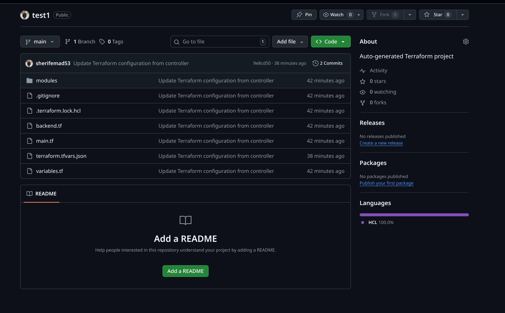
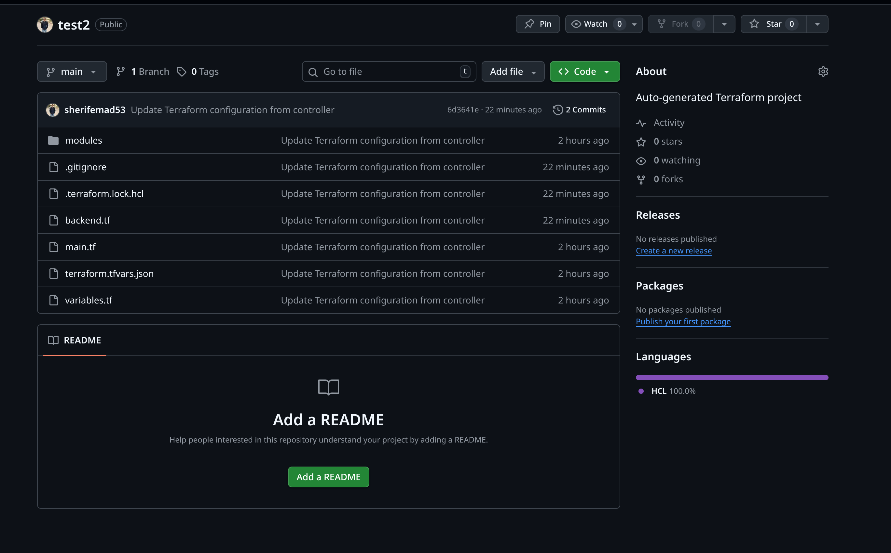
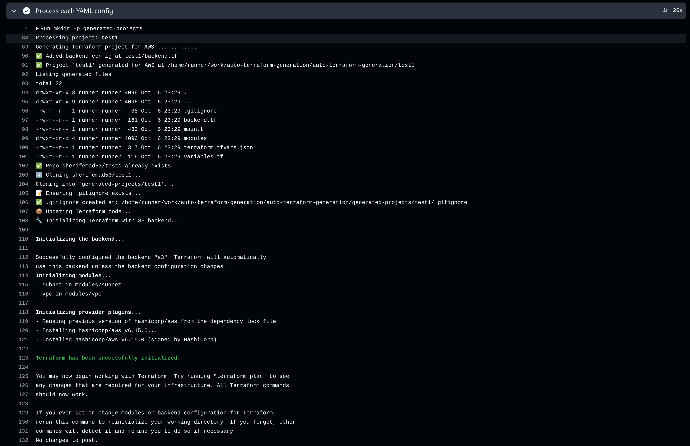
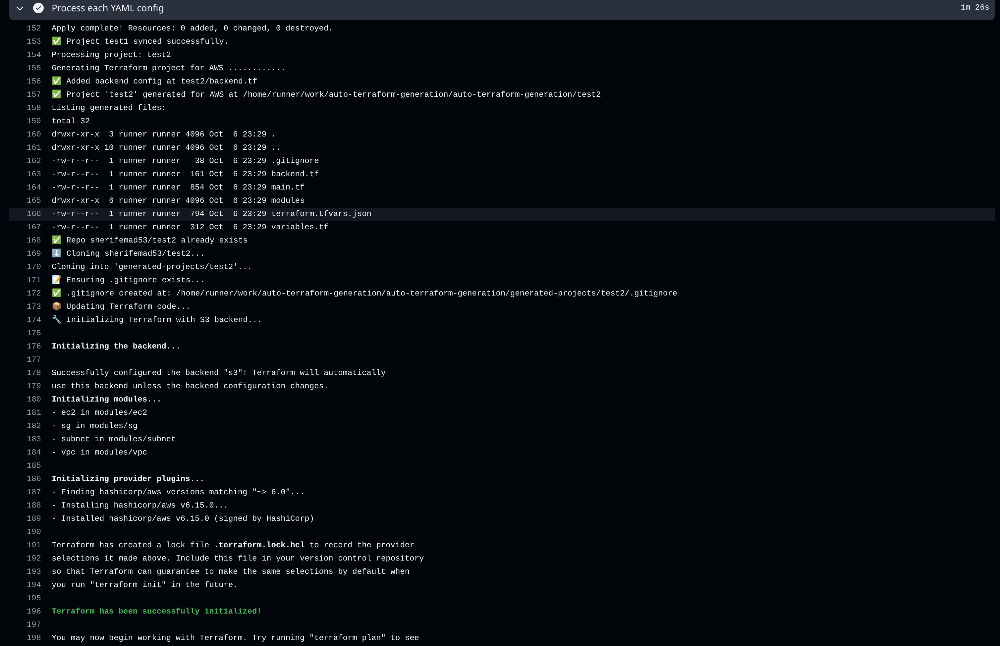
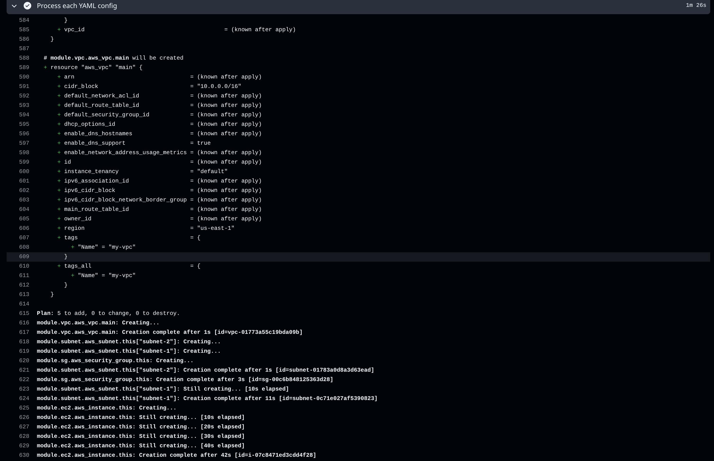
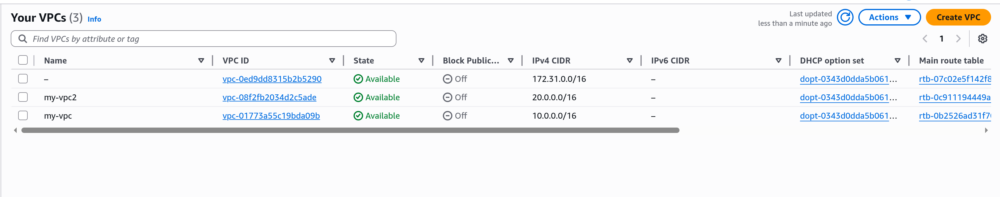
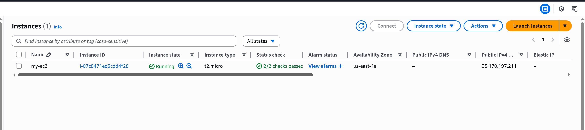
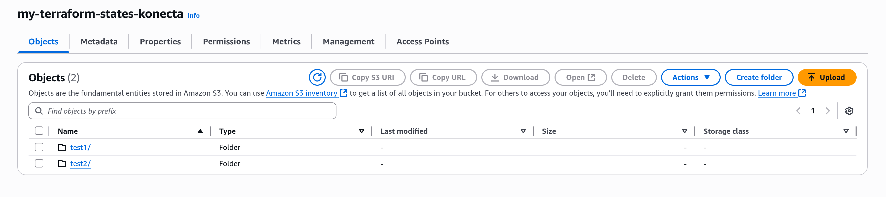
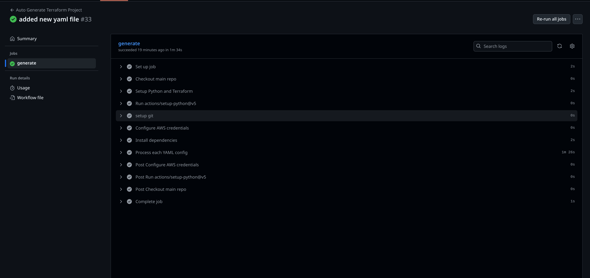

# Auto Terraform Generation (AWS)

This repository provides a Terraform-based framework to provision common AWS infrastructure components, and includes enhanced helper scripts to generate per-project Terraform from YAML with automatic module copying, backend configuration, and state management.

## Features
- **Enhanced YAML-driven project generation** via `scripts/deploy.py`
- **Automatic module copying** and dependency management
- **S3 backend configuration** for state management
- **Git ignore** and project structure setup

## Repository Structure

```
/ (repo root)
├── main.tf                # Root Terraform using AWS modules in ./modules
├── variables.tf           # Input variables for root
├── terraform.tfvars       # Example variable values
├── modules/               # Reusable Terraform modules (vpc, subnet, sg, ec2, s3, alb, igw, nat, rt, eip)
├── scripts/
│   ├── deploy.py          # Enhanced generator: creates project dir, copies modules, adds backend/gitignore
│   └── destroy.py         # Destroy generated project based on YAML filename
├── configs/
│   ├── project-requirments.yaml  # Example full configuration for root
│   └── test1.yaml                # Example for generator flow
├── generated-projects/    # Directory for generated projects (optional)
└── app-requirenemts.md    # Project requirements and context
```

## Prerequisites
- Terraform >= 1.5
- AWS credentials exported in your environment (`AWS_ACCESS_KEY_ID`, `AWS_SECRET_ACCESS_KEY`, and optionally `AWS_DEFAULT_REGION`)
- Python 3.9+

## Quick Start (Root Stack)
1. Review and update `terraform.tfvars` as needed (region, CIDRs, AMI, etc.).
2. Initialize providers and modules:
   ```bash
   terraform init
   ```
3. Review the plan:
   ```bash
   terraform plan
   ```
4. Apply:
   ```bash
   terraform apply
   ```

## Enhanced YAML-driven Generation (scripts/deploy.py)

The enhanced generator reads a YAML config and creates a complete project directory with the following features:

### What it generates:
- **Complete project structure** with proper module organization
- **Automatic module copying** from `./modules/` to project directory
- **Backend configuration** for S3 state management
- **Git ignore** setup for Terraform files
- **Proper variable handling** with support for Terraform expressions
- **Terraform >= 1.5** version requirement

### Example config (`configs/test1.yaml`):
```yaml
region: "us-east-1"
modules:
  vpc:
    vpc_name: "my-vpc"
    vpc_cidr: "10.0.0.0/16"
  subnet:
    vpc_id: "module.vpc.vpc_id"
    subnets:
      subnet-1:
        cidr: "10.0.1.0/24"
        az: "us-east-1a"
        public: true
  sg:
    vpc_id: "module.vpc.vpc_id"
    name: "main-sg"
    ingress_rules:
      - { from_port: 22, to_port: 22, protocol: "tcp", cidr_blocks: ["0.0.0.0/0"] }
    egress_rules:
      - { from_port: 0, to_port: 0, protocol: "-1", cidr_blocks: ["0.0.0.0/0"] }
```

### Usage:
```bash
# Generate project and run plan
python scripts/deploy.py configs/test1.yaml

# Generate project and apply immediately
python scripts/deploy.py configs/test1.yaml --apply
```

This creates a folder `test1/` with:
- Complete Terraform configuration
- Copied modules from `./modules/`
- S3 backend configuration
- Proper `.gitignore`
- Flattened variables in `terraform.tfvars.json`

### Enhanced Features:
- **Module path mapping**: Automatically maps module names to `./modules/{name}` paths
- **Expression support**: Handles `module.*` references correctly in `main.tf`
- **Backend management**: Creates `backend.tf` with S3 configuration
- **State management**: Uses centralized S3 bucket for state storage
- **Project isolation**: Each generated project is self-contained

## Modules Overview
Each module in `modules/` encapsulates a specific AWS resource pattern. For details, read each module’s `variables.tf` and `output(s).tf`. Example for route tables:

```startLine:endLine:modules/rt/README.md
# rt Module
module "rt" {
  source = "./modules/rt"

  name = "example"
  tags = {
    Environment = "dev"
  }
}
```

## Inputs
See `variables.tf` in the root and within each module. Common inputs include:
- `region`, `vpc_name`, `vpc_cidr`, `subnets`
- Security group `name`, `ingress_rules`, `egress_rules`
- EC2 `ami`, `instance_type`, `key_name`, `instance_name`
- S3 `bucket_name`, ALB `name`

## Outputs
Inspect each module’s `output.tf` to discover IDs and ARNs exposed, such as `vpc_id`, `subnet_ids`, `sg_id`, and more.

## Security Considerations
- `terraform.tfvars` allows SSH and HTTP/HTTPS from `0.0.0.0/0` for convenience. Restrict these CIDRs in production.
- Manage state securely (e.g., remote backend like S3 + DynamoDB) if collaborating.

## Cleaning Up
If you applied from the root, you can destroy resources:
```bash
terraform destroy
```

## For generated projects, run destroy script.
```bash
python scripts/destory.py configs/test1.yaml
```

# GitHub Actions CI/CD Pipeline

The project includes automated CI/CD workflows that trigger when YAML configuration files are added or modified in the `configs/` directory.

## Workflow Files
- **`.github/workflows/deploy.yml`** - Automated deployment pipeline
- **`.github/workflows/destroy.yml`** - Infrastructure destruction (currently disabled)

## Deploy Pipeline Features

#### Triggers
- **Push events**: Automatically triggers when any `.yaml` file in `configs/` is modified
- **Manual dispatch**: Can be triggered manually via GitHub Actions UI

#### Pipeline Steps

1. **Environment Setup**
   - Ubuntu latest runner
   - Terraform 1.8.5 installation
   - Python 3.11 setup
   - Git configuration

2. **AWS Configuration**
   - AWS credentials setup via GitHub Secrets
   - Region configuration (us-east-1)
   - S3 state bucket access

3. **Project Generation**
   - Processes each YAML file in `configs/`
   - Runs `scripts/deploy.py` for each configuration
   - Creates isolated project directories

4. **Repository Management**
   - Creates new GitHub repositories for each project (if they don't exist)
   - Clones/updates existing repositories
   - Manages project-specific repositories under your GitHub account

5. **Infrastructure Deployment**
   - Terraform initialization with S3 backend
   - Terraform plan execution
   - Terraform apply with auto-approval
   - Commits and pushes changes to project repositories

#### Required GitHub Secrets

Configure these secrets in your repository settings:

```
AWS_ACCESS_KEY_ID      # Your AWS access key
AWS_SECRET_ACCESS_KEY  # Your AWS secret key
GH_TOKEN              # GitHub personal access token with repo permissions
```

#### Repository Structure Created

For each YAML config file (e.g., `test1.yaml`), the pipeline:
- Creates a new repository: `{your-username}/test1`
- Generates complete Terraform project structure
- Copies modules and configurations
- Sets up S3 backend for state management
- Commits and pushes all files

#### Pipeline Benefits

- **Automated Infrastructure**: No manual intervention required
- **Repository Isolation**: Each project gets its own repository
- **State Management**: Centralized S3 backend for Terraform state
- **Version Control**: Full git history for each project
- **Scalability**: Process multiple configurations simultaneously

#### Usage Example

1. Create a new YAML file in `configs/my-new-project.yaml`
2. Push to your repository
3. Pipeline automatically:
   - Generates Terraform project
   - Creates `my-new-project` repository
   - Deploys infrastructure to AWS
   - Commits all changes

#### Monitoring

The pipeline provides detailed logs for:
- Project generation status
- Repository creation/updates
- Terraform execution results
- Infrastructure deployment status

### Future Enhancements

- **Slack Notifications**: Currently commented out, can be enabled for deployment status updates
- **Destroy Workflow**: Infrastructure cleanup workflow (currently disabled)
- **Multi-environment Support**: Support for dev/staging/prod environments
- **Validation Steps**: Pre-deployment validation and testing


## Screenshots

### Project Generation and Execution

*Generated project structure for test1.yaml*


*Generated project structure for test2.yaml*

### Terraform Execution

*Terraform init and plan execution for test1*


*Terraform init and plan execution for test2*


*Terraform apply execution for test2*

### AWS Resources Created

*VPC resources created in AWS*


*EC2 instances created in AWS*


*S3 bucket created in AWS*

### Pipeline Completion

*Complete pipeline execution summary*

## Roadmap
- ✅ Enhanced variable generation and expression support in `deploy.py`
- ✅ Implemented `scripts/destroy.py` to auto-destroy generated projects based on YAML
- ✅ GitHub Actions CI/CD pipeline for automated deployments
- Support for additional cloud providers (GCP, Azure)
- Enhanced error handling and validation
- Slack/email notifications for deployment status
- Multi-environment support (dev/staging/prod)
- Pre-deployment validation and testing
